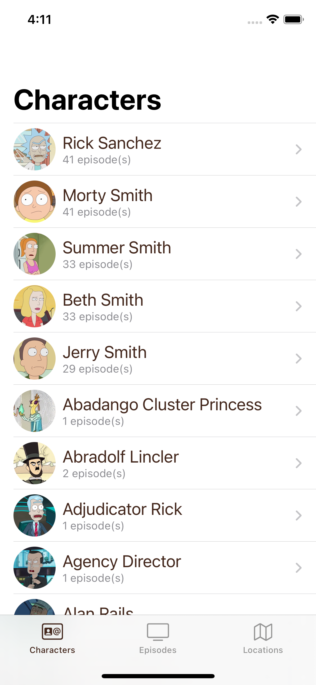

# MortyUI
A very simple Rick & Morty app to demo GraphQL + SwiftUI

This app have a very simple SwiftUI MVVM architecture. 

Each views have its own view model which consist of running a simple GraphQL query to fetch the necassary data. Once the data is set in the `@Published` property of the view model, the data will be displayed in the view. While it's fetching the data, it'll use the powerful SwiftUI `.redacted placeholder` modifier to display a beautiful loading state.

All the queries are in `Queries.graphql`. The file `API.swift` is generated at the build time using the `schema.json` of the GraphQL API of this awesome Rick & Morty API [website](https://rickandmortyapi.com/documentation/#episode-schema) and the `Queries.graphql` file using the [Apollo CLI](https://www.apollographql.com/docs/devtools/cli)

You you check the `run script` part in the `Build Phases` tab of the Xcode project. 

For now you can browse characters, episodes and locations (soon). Search is coming soon. 

This is all an excercice for me to play a bit with GraphQL + SwiftUI. Nothing very exciting on the UI side. The exiting part is that it's actually very little code (just the UI code + some GraphQL queries) to have the app working.

<table>
  <tr>
    <td>Characters</td>
    <td>Character detail</td>
    <td>Episode</td>
  </tr>
  <tr>
    <td></td>
    <td></td>
    <td></td>
  </tr>
 </table>
